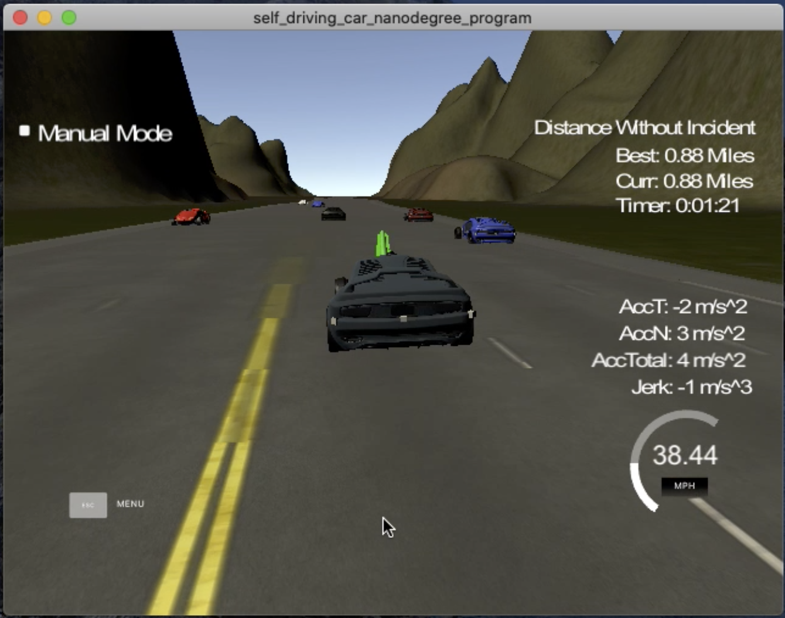

# CarND-Path-Planning-Project
[](http://www.udacity.com/drive)

[](https://youtu.be/E_DrSCbe_X4)

## Writeup

---

**Path Planning Project**
   
### Simulator.
You can download the Term3 Simulator which contains the Path Planning Project from the [releases tab (https://github.com/udacity/self-driving-car-sim/releases/tag/T3_v1.2).  

To run the simulator on Mac/Linux, first make the binary file executable with the following command:
```shell
sudo chmod u+x {simulator_file_name}
```

### Goals
In this project the goal is to safely navigate around a virtual highway with other traffic that is driving +-10 MPH of the 50 MPH speed limit. The car's localization and sensor fusion data are provided, there is also a sparse map list of waypoints around the highway. The car should try to go as close as possible to the 50 MPH speed limit, which means passing slower traffic when possible, note that other cars will try to change lanes too. The car should avoid hitting other cars at all cost as well as driving inside of the marked road lanes at all times, unless going from one lane to another. The car should be able to make one complete loop around the 6946m highway. Since the car is trying to go 50 MPH, it should take a little over 5 minutes to complete 1 loop. Also the car should not experience total acceleration over 10 m/s^2 and jerk that is greater than 10 m/s^3.

## Rubic Points

### Compilation

### The code compiles correctly

Only one line of code inside  `CMakeLists.tx` is modified:
```
set(sources src/main.cpp src/vehicle.cpp src/cost.cpp src/waypoint.cpp src/helpers.cpp)
```
Which is to include all dependencies for compiling the source codes.

To compile the code the following command should be issued from the root folder of the project:

```sh
cmake --build "build" --target all -- -j 14
```

Then the binary file can be executed as follows:

```sh
./build/path_planning
```

### Valid Trajectories

This is the [recorded screen](https://youtu.be/E_DrSCbe_X4) for the car that met the following criterias: 

* The car is able to drive at least 4.32 miles without incident..
* The car drives according to the speed limit.
* Max Acceleration and Jerk are not Exceeded.
* Car does not have collisions.
* The car stays in its lane, except for the time between changing lanes.
* The car is able to change lanes

### Suggestions to Make Your Project Stand Out!

The path planner is able to optimize lane changing through the cost calculation of lane speed. It will only change the lane if it can optimize
its speed towards the goal.

### Reflection

The source code contains 4 main modules to maneuver the car namely prediction, behaviour, and trajectory and path generation. Some part of the codes were taken and extended from the Q&A video from the project page and behavioral planning quiz.


#### Code Structures

All the main file for this project is inside the `src` folder.

* main.cpp
* vehicle.h
* vehicle.cpp
* cost.h
* cost.cpp
* waypoint.h
* waypoint.cpp
* helpers.h
* helpers.cpp
* json.hpp
* spline.h

#### Prediction

The first module is to generate predictions of the other cars from sensor fusion for next likely location. The method used is by projecting the frenet S location from the velocity of the car.

The code that does this can be found in `main.cpp` from line 150 to 165 that essentially iterate all the vehicles found in the sensor fusion data 
and invoke the `Vehicle::generate_predictions(int horizon)`. 

```cpp
vector<Vehicle> predictions;
for (int i = 0; i < horizon; ++i)
{
    // s + prev_size * v * t = s + prev_size(vt)
    // let prev_size = 3 then s + vt + vt + vt
    double next_s = position_at(0.02);
    predictions.push_back(Vehicle(this->x, this->y, next_s, this->d, 0.0, this->speed, this->lane));
}
```

For each of the vehicles found from the sensor fusion we iterate over horizon of previous size of each 20ms and project it's frenet location
using the following equation:

```
new_s = s + velocity + 1/2(acceleration)(time)^2
```

However there is an assumption here which is acceleration is 0. In the future this part can be improved to keep track of the vehicle acceleration as well
to be more accurate in the prediction.

#### Behaviour Planning

The second module is about planning the maneuveur which performs decision making such as lane changes to minimize the cost in achieving the goals. 
In the main, `vector<Vehicle> trajectory = ego.choose_next_state(predictions);` is the one that invoke the behavioral module. 
The `choose_next_state` functions will then choose the next actions from 
Finite State Machine (FSM) through the `vector<string> Vehicle::successor_states()` for the next states the car can 
move into based on its current state.

There are 2 possible states the car can move into:


```cpp
vector<Vehicle> trajectory = generate_trajectory(*it, predictions);
```

For each of the possible states the `generate_trajectory` will generate the car trajectory specifically from these 
two methods:

```cpp
vector<Vehicle> Vehicle::keep_lane_trajectory(map<int, vector<Vehicle>> &predictions)

vector<Vehicle> Vehicle::lane_change_trajectory(string state,
                                                map<int, vector<Vehicle>> &predictions)
```

The brief explanation for `keep_lane_trajectory`

* Measure the distance between vehicle behind and ahead in the same lane.
* If the vehicle in front is less than or equal to the preferred distance buffer, the car will slow down by adjusting the
the velocity
* If the new velocity is lower than the vehicle in front, it will copy its velocity. This is a mechanic to prevent
complete or sudden halt to the car which is unsafe.
* If no vehicle is found in-front or no within the distance buffer, the car will adjust its velocity to achieve the target_speed

The brief explanation for `lane_change_trajectory`

* The lane change only possible after first 300 meter and the difference between last lane change at least 100 meter.
This is to ensure to car stabilise and to balance between safety and arriving destination fast.
* It checks between prediction and trajectory for any vehicle within safe distance (collision). If there is potential collision
then it returns an empty trajectory.
* Adjust the speed to achieve the target_speed.

For each of the trajectory above we will compute its efficiency cost through `calculate_cost` method provided by `cost.cpp` 

```cpp
float cost = (2.0 * vehicle.target_speed - proposed_speed_final ) / vehicle.target_speed;
```

The cost becomes higher for trajectories to the lane that have traffic slower than vehicle's target speed.

The `keep_lane_trajectory` will finally return the trajectories with the lowest cost.


#### Path Generation

The trajectory provided by `keep_lane_trajectory` only consisted of 2 points, the origin and destination.
We need to generate the waypoints between the two points for smooth navigation.

The paths are calculated with the help of splines library based on the vector returned from previous step . 
The class that implement this is the `waypoint.cpp`.

```cpp
Waypoint waypoint = Waypoint(previous_path_x, previous_path_y, map_waypoints_s, map_waypoints_x, map_waypoints_y);
...
...
Vehicle final = trajectory[1];
XY waypoint_xy = waypoint.generate_waypoint(trajectory);
vector<double> next_x_vals = waypoint_xy.x;
vector<double> next_y_vals = waypoint_xy.y;
```

The implementation of the spline library here is taken and modified from the walkthrough video provided in the lesson.

### Technical Details

#### The map of the highway is in data/highway_map.txt
Each waypoint in the list contains  [x,y,s,dx,dy] values. x and y are the waypoint's map coordinate position, the s value is the distance along the road to get to that waypoint in meters, the dx and dy values define the unit normal vector pointing outward of the highway loop.

The highway's waypoints loop around so the frenet s value, distance along the road, goes from 0 to 6945.554.

## Basic Build Instructions

1. Clone this repo.
2. Make a build directory: `mkdir build && cd build`
3. Compile: `cmake .. && make`
4. Run it: `./path_planning`.

Here is the data provided from the Simulator to the C++ Program

#### Main car's localization Data (No Noise)

["x"] The car's x position in map coordinates

["y"] The car's y position in map coordinates

["s"] The car's s position in frenet coordinates

["d"] The car's d position in frenet coordinates

["yaw"] The car's yaw angle in the map

["speed"] The car's speed in MPH

#### Previous path data given to the Planner

//Note: Return the previous list but with processed points removed, can be a nice tool to show how far along
the path has processed since last time. 

["previous_path_x"] The previous list of x points previously given to the simulator

["previous_path_y"] The previous list of y points previously given to the simulator

#### Previous path's end s and d values 

["end_path_s"] The previous list's last point's frenet s value

["end_path_d"] The previous list's last point's frenet d value

#### Sensor Fusion Data, a list of all other car's attributes on the same side of the road. (No Noise)

["sensor_fusion"] A 2d vector of cars and then that car's [car's unique ID, car's x position in map coordinates, car's y position in map coordinates, car's x velocity in m/s, car's y velocity in m/s, car's s position in frenet coordinates, car's d position in frenet coordinates. 

## Details

1. The car uses a perfect controller and will visit every (x,y) point it recieves in the list every .02 seconds. The units for the (x,y) points are in meters and the spacing of the points determines the speed of the car. The vector going from a point to the next point in the list dictates the angle of the car. Acceleration both in the tangential and normal directions is measured along with the jerk, the rate of change of total Acceleration. The (x,y) point paths that the planner recieves should not have a total acceleration that goes over 10 m/s^2, also the jerk should not go over 50 m/s^3. (NOTE: As this is BETA, these requirements might change. Also currently jerk is over a .02 second interval, it would probably be better to average total acceleration over 1 second and measure jerk from that.

2. There will be some latency between the simulator running and the path planner returning a path, with optimized code usually its not very long maybe just 1-3 time steps. During this delay the simulator will continue using points that it was last given, because of this its a good idea to store the last points you have used so you can have a smooth transition. previous_path_x, and previous_path_y can be helpful for this transition since they show the last points given to the simulator controller with the processed points already removed. You would either return a path that extends this previous path or make sure to create a new path that has a smooth transition with this last path.

---

## Dependencies

* cmake >= 3.5
  * All OSes: [click here for installation instructions](https://cmake.org/install/)
* make >= 4.1
  * Linux: make is installed by default on most Linux distros
  * Mac: [install Xcode command line tools to get make](https://developer.apple.com/xcode/features/)
  * Windows: [Click here for installation instructions](http://gnuwin32.sourceforge.net/packages/make.htm)
* gcc/g++ >= 5.4
  * Linux: gcc / g++ is installed by default on most Linux distros
  * Mac: same deal as make - [install Xcode command line tools]((https://developer.apple.com/xcode/features/)
  * Windows: recommend using [MinGW](http://www.mingw.org/)
* [uWebSockets](https://github.com/uWebSockets/uWebSockets)
  * Run either `install-mac.sh` or `install-ubuntu.sh`.
  * If you install from source, checkout to commit `e94b6e1`, i.e.
    ```
    git clone https://github.com/uWebSockets/uWebSockets 
    cd uWebSockets
    git checkout e94b6e1
    ```


